# Senegalese Association Management (SAM) - Architecture Diagram

## System Overview

```mermaid
graph TB
    subgraph "Client Layer"
        Web[Web Browser]
        Mobile[Mobile Browser]
    end
    
    subgraph "Presentation Layer"
        subgraph "Public Area"
            HomeController[Home Controller]
            PublicViews[Public Views]
        end
        
        subgraph "Admin Area"
            AdminControllers[Admin Controllers]
            AdminViews[Admin Views]
            AdminAuth[Admin Authentication]
        end
    end
    
    subgraph "Business Logic Layer"
        subgraph "Controllers"
            HC[Home Controller]
            AC[Account Controller]
            DC[Dashboard Controller]
            EC[Events Controller]
            FC[Finance Controller]
            LC[Leadership Controller]
            SC[Services Controller]
            SYS[System Controller]
            TC[Testimonials Controller]
            UC[Users Controller]
            CM[Contact Messages Controller]
        end
        
        subgraph "Services"
            Auth[ASP.NET Identity]
            Cookie[Cookie Authentication]
            Validation[Model Validation]
        end
    end
    
    subgraph "Data Access Layer"
        EF[Entity Framework Core]
        Context[Application DbContext]
        
        subgraph "Models"
            User[Application User]
            Event[Event]
            Service[Service]
            Leadership[Leadership]
            Community[Community Highlight]
            Testimonial[Testimonial]
            Contact[Contact Message]
        end
    end
    
    subgraph "Database Layer"
        SQLDB[(SQL Server Database)]
        
        subgraph "Tables"
            UserTbl[Users & Identity Tables]
            EventTbl[Events]
            ServiceTbl[Services]
            LeadershipTbl[Leadership]
            CommunityTbl[Community Highlights]
            TestimonialTbl[Testimonials]
            ContactTbl[Contact Messages]
        end
    end
    
    subgraph "Static Resources"
        CSS[CSS Files]
        JS[JavaScript Files]
        Images[Images/Assets]
        Bootstrap[Bootstrap Framework]
        jQuery[jQuery Library]
    end

    %% Connections
    Web --> HomeController
    Mobile --> HomeController
    Web --> AdminAuth
    Mobile --> AdminAuth
    
    HomeController --> PublicViews
    AdminAuth --> AdminControllers
    AdminControllers --> AdminViews
    
    HC --> Context
    AC --> Auth
    DC --> Context
    EC --> Context
    FC --> Context
    LC --> Context
    SC --> Context
    SYS --> Context
    TC --> Context
    UC --> Context
    CM --> Context
    
    Auth --> Cookie
    Context --> EF
    EF --> SQLDB
    
    User --> UserTbl
    Event --> EventTbl
    Service --> ServiceTbl
    Leadership --> LeadershipTbl
    Community --> CommunityTbl
    Testimonial --> TestimonialTbl
    Contact --> ContactTbl
    
    PublicViews --> CSS
    PublicViews --> JS
    AdminViews --> CSS
    AdminViews --> JS
    CSS --> Bootstrap
    JS --> jQuery

    %% Styling
    classDef client fill:#e1f5fe
    classDef presentation fill:#f3e5f5
    classDef business fill:#e8f5e8
    classDef data fill:#fff3e0
    classDef database fill:#ffebee
    classDef static fill:#f1f8e9
    
    class Web,Mobile client
    class HomeController,PublicViews,AdminControllers,AdminViews,AdminAuth presentation
    class HC,AC,DC,EC,FC,LC,SC,SYS,TC,UC,CM,Auth,Cookie,Validation business
    class EF,Context,User,Event,Service,Leadership,Community,Testimonial,Contact data
    class SQLDB,UserTbl,EventTbl,ServiceTbl,LeadershipTbl,CommunityTbl,TestimonialTbl,ContactTbl database
    class CSS,JS,Images,Bootstrap,jQuery static
```

## Component Details

### Technology Stack
- **Framework**: ASP.NET Core 8.0 (MVC Pattern)
- **Authentication**: ASP.NET Identity with Cookie Authentication
- **Database**: SQL Server with Entity Framework Core
- **Frontend**: Razor Views, Bootstrap 5, jQuery
- **Development**: Hot reload with Razor Runtime Compilation

### Key Components

#### 1. **Controllers**
- **HomeController**: Handles public-facing pages (About, Contact, Events, Index)
- **Admin Area Controllers**: 
  - AccountController: Admin authentication
  - DashboardController: Admin dashboard
  - EventsController: Event management
  - FinanceController: Financial management (donations, reports)
  - LeadershipController: Leadership profiles management
  - ServicesController: Service offerings management
  - SystemController: System settings and logs
  - TestimonialsController: Testimonial management
  - UsersController: User management
  - ContactMessagesController: Contact form submissions

#### 2. **Data Models**
- **ApplicationUser**: Extended Identity user with FirstName, LastName, IsActive
- **Event**: Community events with title, description, date, location, category
- **Service**: Service offerings with title, description, icon
- **Leadership**: Leadership profiles with bio, position, welcome message
- **CommunityHighlight**: Statistics and achievements display
- **Testimonial**: User testimonials with author information
- **ContactMessage**: Contact form submissions

#### 3. **Security Features**
- Role-based access control (Admin area protected)
- Secure cookie configuration (HttpOnly, Secure, SameSite)
- Password policy enforcement
- Account lockout protection
- HTTPS redirection

#### 4. **Database Configuration**
- Entity Framework migrations for schema management
- Automatic timestamp updates (ITimestamped interface)
- Optimized indexing for performance
- Seed data initialization

### Architecture Patterns
- **MVC (Model-View-Controller)**: Clear separation of concerns
- **Area-based Organization**: Admin functionality isolated in separate area
- **Repository Pattern**: Entity Framework DbContext as data access layer
- **Dependency Injection**: Built-in ASP.NET Core DI container
- **Configuration Pattern**: appsettings.json for environment-specific settings

### Data Flow
1. **Public Users**: Browse events, services, leadership, submit contact forms
2. **Admin Users**: Authenticate → Access admin dashboard → Manage content
3. **Database Operations**: Controllers → DbContext → Entity Framework → SQL Server
4. **Static Content**: Served directly from wwwroot folder

This architecture provides a clean separation between public and administrative functionality, with secure authentication and efficient data management for the Senegalese Association Management system.

ey Architecture Components:

  Technology Stack:
  - ASP.NET Core 8.0 MVC
  - ASP.NET Identity for authentication
  - Entity Framework Core with SQL Server
  - Bootstrap + jQuery frontend

  Main Layers:
  1. Client Layer - Web/mobile browsers
  2. Presentation Layer - Public area (Home) + Admin area with authentication
  3. Business Logic - 10+ controllers managing different aspects (events, finance, leadership, etc.)
  4. Data Access - Entity Framework with 7 core models
  5. Database - SQL Server with optimized tables and indexing

  Security Features:
  - Role-based admin access
  - Secure cookie configuration
  - Password policies and account lockout